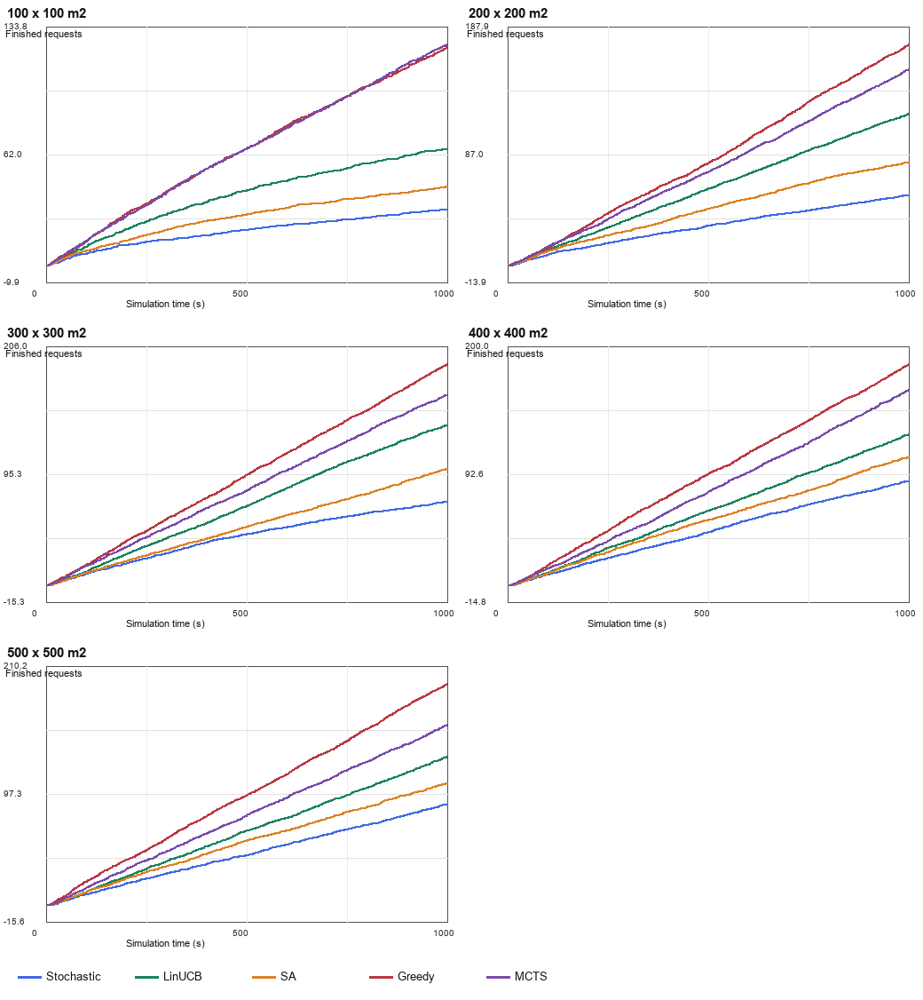
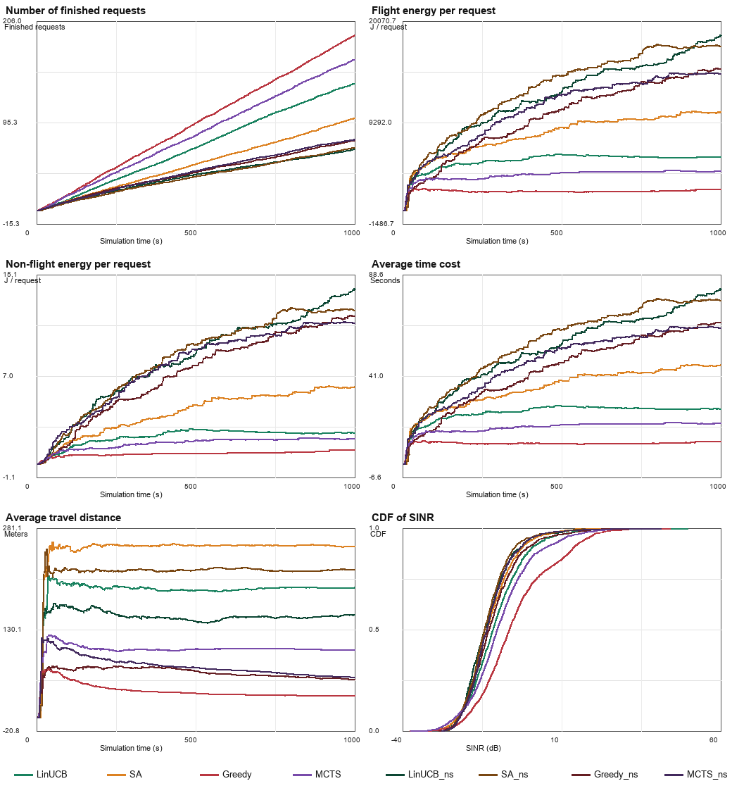

# AirTalking 논문 실험 재현 보고서

> 작성 기준일: 2026-07-12  
> 핵심 결론: 이 저장소는 AirTalking의 공개 수식·Table III 상수·정성적 실험 흐름을 바탕으로 한 **독립 Python 재구현**이다. 현재 결과는 일부 방향성을 재현하지만, 논문 수치의 정량 재현에는 실패했다. 원본 코드·raw plot data·여러 simulator 상수가 비공개이므로 “완전 재현”이라는 표현을 쓰면 안 된다.

## 1. 재현의 의미부터 구분하기

- **반복(repetition)**: 저자가 공개한 같은 코드와 데이터를 같은 조건에서 다시 실행한다.
- **재현(reproduction)**: 논문 설명만 보고 독립적으로 코드를 만들어 같은 결론이 나오는지 본다.
- **복제(replication)**: 다른 데이터·조건에서도 결론이 유지되는지 본다.

AirTalking 원본 simulator와 neural codec 코드는 이 저장소에 없고 논문에도 공개 경로가 제시되지 않았다. 따라서 본 작업은 첫 번째가 아니라 두 번째에 해당한다. 그중에서도 미공개 항목을 가정했기 때문에 **부분 재현 시도**라고 부르는 것이 정확하다.

## 2. 논문 근거 지도

쪽수는 저장소의 PDF를 PDF 뷰어로 열었을 때의 페이지 기준이다.

| 근거 | 위치 | 확인한 내용 |
|---|---|---|
| 의미 압축률 정의 | PDF 5쪽, 식 (22) | encoded semantic payload length / raw payload length |
| Neural codec 설명 | PDF 7쪽, 성능평가 절 | Cityscapes, modified U-Net encoder, modified Pix2PixHD decoder |
| Codec 장치·환경 | PDF 7쪽, Table II | 서로 다른 두 Jetson 장치와 software stack |
| Simulator·codec 상수 | PDF 8쪽, Table III | UAV/device, 이동·채널·전송·반복 조건 |
| 핵심 결과 그림 | PDF 9~11쪽, Fig. 3~6 | 완료 수, 에너지, 시간, 거리, SINR, encode/decode 수, semantic/nonsemantic 비교 |

### 2.1 논문 Table II

| 역할 | 공개 환경 |
|---|---|
| Encoder | Jetson Orin Nano 8GB, Ubuntu 22.04, Python 3.10.12, PyTorch 2.4, CUDA 12.2, cuDNN 8.9, modified U-Net |
| Decoder | Jetson AGX Xavier 32GB, Ubuntu 20.04, Python 3.8.10, PyTorch 2.1, CUDA 11.8, cuDNN 8.6, modified Pix2PixHD |

Table II는 속도 비교에서 매우 중요하다. 저장소의 기존 neural 결과는 로컬 CPU에서 128×64 한 장을 측정했다. 장치, 입력 크기, framework가 다르므로 처리율이 비슷하다는 사실만으로 codec 재현을 입증할 수 없다.

### 2.2 논문 Table III

다음 숫자는 논문 감사에서 직접 확인한 값만 적었다.

| 구분 | 논문 공개값 |
|---|---:|
| UAV 수 / ground device 수 | 20 / 20 |
| slot 길이 | 1 s |
| 최대 UAV 속도 | 23 m/s |
| 가속 / 감속 | 3 / -2 m/s² |
| 평균 고도 | 20 m |
| 최소 수직 간격 | 0.5 m |
| 대역폭 | 80 MHz |
| carrier frequency | 5 GHz |
| UAV / ground-device 송신 전력 | 0.2 / 0.1 W |
| noise PSD | \(4\times10^{-21}\) W/Hz |
| noise figure | 5 dB |
| U2U / U2G path-loss exponent | 2.2 / 2.7 |
| U2U Rician factor | 10 dB |
| U2G Rician factor | 0~15 dB |
| 시뮬레이션 길이 T | 1,000 slots |
| 반복 | 10 |
| 정사각 영역 한 변 | 100, 200, 300, 400, 500 m |
| 정책 | Stochastic, LinUCB, SA, Greedy, MCTS |
| \(\rho_c\) / \(\rho_r\) | 0.104 / 3 |
| encoding / decoding | 91.30 / 23.23 Mbps |

**U2U**는 UAV-to-UAV, **U2G**는 UAV-to-ground link다. **Rician factor**는 직접 경로가 있는 무선 fading의 강도를 나타내는 값이다.

이 표의 “논문 공개값”과 현재 코드의 “구현된 `PaperParams`”는 같은 집합이 아니다. 예를 들어 0.5 m 고도 간격은 현재 위치 생성식에 상수로 들어가고, U2G Rician factor 0~15 dB 변화는 별도 parameter/model로 구현되지 않았다. 반대로 runtime의 `paper_params`는 `--semantic-summary`, `--repeats`, `--t-slots`로 바뀔 수 있다. 따라서 순수 공개값은 위 근거표로, 한 run의 실제 적용값은 `run_metadata.json`의 `paper_params`와 `semantic_profile`을 함께 확인한다.

### 2.3 Fig. 3~6이 비교하는 것

- Fig. 3: 완료 request 수, request당 비행/비비행 에너지
- Fig. 4: 평균 시간 비용, 평균 이동 거리, SINR CDF
- Fig. 5: encoding/decoding 수행 횟수
- Fig. 6: 300×300 m에서 semantic과 nonsemantic 방식 비교

**CDF(cumulative distribution function)**는 “SINR이 어떤 값 이하일 확률”을 누적해 그린 곡선이다. 논문은 그림의 raw 좌표 CSV를 공개하지 않았다. 저장소 verifier의 paper-side 좌표는 그림을 육안/벡터로 읽은 근삿값이며 논문이 표로 발표한 숫자가 아니다.

## 3. 공개되지 않아 정확히 재현할 수 없는 항목

### 3.1 Neural codec

- 정확한 encoder/decoder 구조와 weight
- latent tensor와 직렬화 규약
- quantization·entropy codec
- loss·optimizer·epoch·입력 크기·seed
- RGB/semantic 복원 품질
- \(\rho_r=3\)의 정의식

### 3.2 Simulator

- request 발생 확률과 workload 분포
- ground device 이동 과정의 정확한 수치
- 이동/hover power, codec power
- 동시 전송·간섭 scheduling의 전체 구현
- 각 정책의 tie-breaking과 후보 sampling 상세
- 원본 source code, raw time series, raw plot data

미공개 값은 결과에 작은 잡음이 아니라 수배 차이를 만들 수 있다. 완료 request 수는 arrival rate에, 시간은 workload bit 수에, 비행 에너지는 이동/hover power에 직접 비례한다.

## 4. 이 저장소의 재현 파이프라인

```text
논문 Table III 공개 상수
          +
명시적으로 분리한 AssumedParams
          +
선택적 Cityscapes/neural semantic profile
          ↓
1초 단위 event simulation × 1,000 slots × 10 repeats
          ↓
semantic: 5개 면적 × 5개 정책 = 25개 조합
nonsemantic: 300 m × LinUCB/SA/Greedy/MCTS = 4개 조합
          ↓
summary CSV + time-series NPZ + figures + metadata
          ↓
논문 Fig. 3/4/6 digitized 근삿값과 verifier 비교
```

메인 구현은 `studies/airtalking_reproduction/code/airtalking_reproduction.py`다.

## 5. 한 request가 처리되는 과정

### 5.1 상태 생성

각 반복에서 20개 ground device와 20개 UAV의 위치를 정사각 영역에 배치한다. UAV 높이는 평균 20 m를 중심으로 인접 UAV가 0.5 m 차이 나도록 만든다. seed는 기본 seed, 면적, 반복 번호, semantic 여부, 정책 index를 조합한다.

매 slot에서 다음을 반복한다.

1. 끝난 action의 UAV와 device를 해제한다.
2. 바쁘지 않은 ground device를 reflected random walk로 움직인다.
3. 각 유휴 device가 확률적으로 request를 만든다.
4. 목적 device, workload, 송수신 UAV, semantic encode/decode 상태 후보를 만든다.
5. 정책이 후보 하나를 고른다.
6. 이동·encoding·D2D·decoding 시간과 에너지를 계산한다.
7. action 완료 때 누적 통계에 반영한다.

### 5.2 이동 시간

이동 거리가 길면 최대 속도까지 가속한 뒤 정속 이동하고 감속한다. 짧으면 최대 속도에 닿기 전에 감속하는 삼각 속도 곡선을 쓴다. 송신 UAV와 수신 UAV 이동은 병렬로 보아 둘 중 긴 시간을 request 이동 시간으로 쓴다.

### 5.3 채널과 전송률

원하는 신호, 동시 action의 UAV/ground 간섭, noise를 이용해 SINR을 만든다. 전송률은 Shannon 형태를 쓴다.

\[
R=B\log_2(1+SINR)
\]

여기서 \(B=80\) MHz다. **SINR**은 원하는 신호 세기를 간섭과 잡음으로 나눈 비율이다. 높을수록 같은 payload를 빨리 보낼 수 있다.

현재 구현은 작은 영역의 강한 간섭 경향을 흉내 내기 위해 다음 `density_penalty`를 추가한다.

\[
1+s\left(\frac{100}{\text{span}}\right)^2
\]

이 항의 scale \(s\)는 논문 공개값이 아니라 로컬 가정이다. 또한 현재 `link_sinr`는 U2G 간섭에도 U2U의 10 dB Rician factor를 사용한다. 논문 Table III의 U2G 0~15 dB 변화를 별도로 구현하지 않았으므로 채널 모델은 정확 재현이 아니다.

### 5.4 Semantic 처리 시간

현재 simulator의 핵심 시간식은 다음 형태다.

\[
t_{tx}=\frac{W\rho}{R},\quad
t_{enc}=\frac{W\phi}{v_{enc}},\quad
t_{dec}=\frac{W\rho\rho_r}{v_{dec}}
\]

- \(W\): raw workload bit
- \(\rho\): semantic이면 compression ratio, 아니면 1
- \(R\): link rate
- \(v_{enc},v_{dec}\): encoding/decoding throughput
- \(\phi\): workload 크기에 따른 로컬 보정값, 최소 0.15~최대 1

\(\phi\) 역시 논문 공개식이 아니다. decode는 송신측 semantic encode와 수신측 semantic decode가 모두 선택될 때만 더해진다.

### 5.5 목적 비용과 에너지

```text
duration = max(tx 이동, rx 이동) + encode + D2D + decode
flight energy = 이동 power×이동시간 + 2×hover power×처리시간
nonflight energy = radio + encoder + decoder energy
cost = duration + energy_weight×전체 energy
```

energy weight와 power는 `AssumedParams`다. 따라서 논문 energy 그림과의 일치는 이 가정에 크게 좌우된다.

## 6. 정책 구현의 의미

- **Stochastic**: 후보를 무작위로 고른다.
- **Greedy**: 현재 계산한 cost가 가장 작은 후보를 고른다.
- **SA(simulated annealing)**: 무작위 후보를 탐색하면서 나쁜 이동도 온도에 따라 잠시 허용한다.
- **MCTS**: 후보 일부를 sampling해 낮은 cost와 semantic 선택에 약한 보너스를 주는 UCT-like 근사다.
- **LinUCB**: 이동·시간·에너지·semantic 여부·workload feature로 상한신뢰도 점수를 학습한다.

이 구현은 논문에서 이름이 같은 알고리즘의 핵심 아이디어를 따른 독립 근사다. 원본 action space, reward, iteration, tie-breaking이 공개되지 않았으므로 알고리즘 이름이 같아도 같은 실행은 아니다. 특히 현재 MCTS는 완전한 tree rollout보다 sampled-candidate optimism에 가깝다.

## 7. Cityscapes profile의 두 단계와 그 한계

### 7.1 과거 label proxy

`measure_cityscapes_semantics.py`는 RGB를 neural encoder에 넣지 않는다. 정답 `gtFine labelIds`를 직접 사용한다.

- `zlib` profile: 정답 label map bytes를 zlib으로 압축
- `feature` profile: 정답 label map을 0.56배로 nearest resize한 uint8 배열
- raw 기준: 2048×1024×3 RGB bytes

0.56배 label의 이론 비율은 대략 \(0.56^2/3\)이므로 0.1045 근처다. 즉 paper-like ratio는 학습으로 발견된 값이 아니라 resize scale로 맞춘 값이다. 정답 label을 직접 보내므로 encoder 오류가 전혀 없고, 실제 RGB→semantic codec의 품질을 과대평가한다.

`rho_r_proxy=3`은 “RGB 3채널 대 label 1채널”로 설명되지만 논문은 \(\rho_r\) 정의식을 공개하지 않았다. 따라서 같은 의미라고 단정할 수 없다.

### 7.2 기존 neural profile

기존 `paperlike_timed_latent20`은 RGB→latent→segmentation을 실제 학습했다. 그러나 latent는 float 상태이며 8비트는 계산상 가정이고, decoder는 RGB를 복원하지 않는다. simulator에 들어간 mIoU와 처리율은 이 대체 모델의 값이지 논문 codec의 값이 아니다.

### 7.3 강화 profile

강화 모델은 실제 uint8 전송을 사용하는 20/40/60/80/120채널 RGB+segmentation profile을 JSON으로 내보낸다. AirTalking의 fixed semantic run은 그중 80채널 paper-like 지점의 payload·mIoU·RGB 품질과 neural feature timing을 사용한다. 최종 profile은 80채널 best와 마지막 epoch를 같은 다섯 rate에서 비교해 mean-5-rate mIoU가 더 큰 가중치에서 나온다.

| 필드 | profile 기록값 |
|---|---|
| schema version | 2 |
| 출처 분류 | paper-inspired independently specified follow-up experiment |
| paper-like 채널 | 80 |
| ρ uint8 | 0.1041667 |
| ρ zlib | 0.0992756 |
| mIoU / pixel acc. | 0.305416 / 0.828616 |
| RGB PSNR / SSIM | 18.435 / 0.567506 |
| encode / decode 처리율 | 420.058 / 81.598 Mbps |
| 평가 표본 | 500 |
| multi-rate 지점 수 | 5 |

이 profile도 논문 정확 codec이라고 부르지 않으며, 동일 simulator에서 기존 profile을 교체했을 때 민감도가 어떻게 변하는지를 보는 용도다. 입력 PNG byte는 측정하지 않았고 GPU timing은 CPU 직렬화·zlib transport를 제외하므로 PNG ratio나 zlib end-to-end 처리율을 보완해 만들어내지 않는다.

## 8. 공개값과 가정값을 분리한 감사

`run_metadata.json`에는 effective `paper_params`, `assumed_params`, `semantic_profile`이 분리되어 있다. `AssumedParams`는 논문에 수치가 없거나 독립 구현에서 추가한 request/workload/device 이동/power/간섭 보정/정책 탐색/seed 값이다. `paper_params`라고 해서 무조건 순수 논문값인 것은 아니며 semantic summary가 적용되면 \(\rho_c\)와 처리율 등이 measured substitute 값으로 바뀐다. 대표 calibrated artifact의 가정은 다음과 같다.

| 가정 항목 | 저장값 |
|---|---:|
| request probability | 0.012 / device / slot |
| workload mean/std | 140 / 35 Mbit |
| workload min/max | 60 / 260 Mbit |
| move/hover power | 130 / 115 W |
| density interference scale | 12 |
| energy weight | 0.000111111 |
| LinUCB candidate samples | 10 |
| SA iterations | 2 |
| MCTS samples | 80 |
| random semantic encode/decode 확률 | 0.25 / 0.5 |
| seed | 260707 |

이 표는 논문값이 아니다. 파일 이름의 `calibrated`는 Fig. 3/4/6의 digitized 추정치에 가까워지도록 일부 hidden parameter를 조정했다는 뜻이다. `calibrate_airtalking_params.py` 자체가 같은 paper figure 추정치로 score를 계산하므로, 같은 그림을 다시 verifier로 평가하면 train/validation data를 재사용하는 것과 같다. 즉 calibrated 결과는 독립적인 out-of-sample 검증이 아니다.

아래 재현 명령은 이 가정 묶음을 암묵적 default로 다시 만들지 않고 `--assumed-metadata`로 명시한다. CLI의 `--assumed KEY=VALUE`를 추가하면 그 값이 metadata보다 우선하며 provenance에 남는다.

또 현재 calibration script의 기본 workload/power 후보와 최종 `p012` metadata의 값이 일치하지 않고, 최종 선택 과정을 연결하는 candidate CSV가 이 저장소 목록에 없다. 따라서 최종 calibration 계보를 명령 하나로 완전히 복구할 수 없다.

## 9. 기존 실험 결과

### 9.1 Neural profile을 넣은 300×300 m 결과

`airtalking_neural_encoder_decoder_timed` 저장 결과의 10회 평균이다.

| 정책 | Semantic 완료 수 | Nonsemantic 완료 수 | Semantic 평균 시간(s) |
|---|---:|---:|---:|
| LinUCB | 127.9 | 66.5 | 26.45 |
| SA | 101.4 | 68.3 | 46.81 |
| Greedy | 184.0 | 75.9 | 10.63 |
| MCTS | 160.8 | 77.0 | 19.86 |

이 결과에서는 네 정책 모두 semantic 완료 수가 nonsemantic보다 높다. 그러나 이것은 로컬 simulator와 가정 안의 방향성 결과다. 논문 그림과 정량 일치한다는 뜻은 아니다.

이 `airtalking_neural_encoder_decoder_timed` 결과는 자체 metadata에 기존 single-rate neural summary 적용을 기록한다. 반면 `adaptive_semantic_compression/results/full_adaptive_results`라는 별도 legacy adaptive run에는 neural source가 실제로 기록·적용되지 않았고 label proxy를 사용했다. 두 결과의 provenance를 섞어 “legacy adaptive도 neural anchor를 썼다”고 해석하면 안 된다.

### 9.2 논문 그림 verifier 결과

verifier는 paper figure digitization과 reproduction의 상대오차를 다음 규칙으로 분류한다.

- `match`: 25% 이하
- `partial`: 25% 초과 50% 이하
- `mismatch`: 50% 초과

이 경계는 통계적 신뢰구간이 아니라 저장소가 정한 편의 규칙이다. 한 실행당 73개 수치 비교가 있다.

| 결과 폴더 | Match | Partial | Mismatch | 판단 |
|---|---:|---:|---:|---|
| `airtalking_cityscapes_feature_paperhw` | 6 | 14 | 53 | 정량 재현 실패 |
| `airtalking_cityscapes_calibrated_final_p012` | 18 | 15 | 40 | 개선됐지만 정량 재현 실패 |
| `airtalking_neural_encoder_decoder_timed` | 20 | 12 | 41 | 일부 개선, 여전히 정량 재현 실패 |

세 결과 모두 semantic이 nonsemantic보다 완료 수에서 유리하다는 300 m 방향성은 통과했다. 반면 평균 시간, 에너지, 일부 정책 ranking과 크기에서 큰 차이가 남았다.

### 9.3 Fig. 3~6 수치의 표현 원칙

`verify_against_paper.py`의 `PAPER_*` 배열은 raw paper data가 아니라 그림을 읽어 만든 근삿값이다. 보고서나 논문에 인용할 때는 반드시 다음처럼 적어야 한다.

> “AirTalking 논문 Fig. 3/4/6의 공개 raw data가 없어, 렌더링된 그림에서 추정한 좌표와 비교했다.”

“논문은 정확히 X를 보고했다”라고 표 값처럼 인용하면 안 된다.

## 10. 결과 신뢰성 감사

### 10.1 신뢰할 수 있는 부분

- PDF에서 직접 확인한 Table II, Table III, 식 (22)
- 저장 코드의 수식과 default/override 분리
- 일반 재현 CSV의 실제 coverage(semantic 25개 + 300 m nonsemantic 4개)와 repeat 집계 구조
- seed를 명시한 deterministic simulator 실행
- semantic 25개 조합과 300 m의 nonsemantic 네 정책을 같은 구현에서 일관되게 비교한 것

### 10.2 제한적으로 신뢰할 부분

- 기존 neural mIoU 0.2135: 해당 부분집합·해상도·checkpoint에 대한 내부 val 수치
- 처리 시간: 해당 로컬 장치에서의 측정
- calibrated 결과: 조정한 simulator 안의 재실행 결과
- paper figure match count: digitization 오차와 임의 threshold를 포함한 진단 지표

### 10.3 논문 재현 증거로 쓰면 안 되는 부분

- gtFine 정답 label resize 품질을 neural codec 품질로 해석
- 채널/stride로 정해진 0.104를 학습 성공으로 해석
- 로컬 CPU 처리율과 Jetson Table II 처리율의 근접성을 구조 동일성으로 해석
- \(\rho_r=3\) proxy를 논문 decoder 정의와 동일하다고 해석
- 같은 figure로 calibration하고 validation한 뒤 독립 재현이라고 해석
- `result_validation.json`의 `passed=true`를 논문 일치로 해석

Schema v2의 상위 `passed=true`는 행 coverage·고유 키·finite 값·비교 분모 같은 **산출물 무결성**이 통과했다는 뜻이다. Adaptive 방향 가설은 별도 `adaptive_vs_fixed.all_comparisons_pass`와 조합별 `pass`에 기록된다. 둘 어느 것도 논문 Fig. 3~6 일치나 통계적 유의성을 뜻하지 않는다.

### 10.4 Artifact provenance 문제

기존 adaptive metadata의 source 경로에는 현재 workspace가 아닌 `C:\Users\user\Desktop\research\...` 절대 경로가 남아 있다. 현재 파일 내용은 읽을 수 있지만, 원래 생성 환경과 입력 파일을 경로 그대로 따라갈 수 없다. 강화 실행에서는 다음 항목을 기록하고 strict finalizer가 이를 감사한다.

- 실제 command line
- git commit과 dirty 여부
- 입력 파일 fingerprint
- Python/package/CUDA/cuDNN/GPU
- seed와 모든 override
- checkpoint hash
- 시작/종료 시각과 정상 종료 상태

강화 checkpoint는 대용량이라 git-ignore 상태여도 로컬 provenance artifact로 사용할 수 있다. 다만 strict finalizer는 metadata가 가리키는 실제 로컬 파일을 요구하고, 다른 장비에서의 배포·감사를 위해서는 checkpoint와 hash를 별도로 보존해야 한다. 학습 run은 실행 당시 `training_source_snapshot.py`와 source SHA-256을 남긴다. verifier는 입력 summary 경로·SHA-256, row/verdict count를 companion manifest에 고정한다.

| 항목 | metadata 기록 |
|---|---|
| repeat × slot | 10 × 1,000 |
| UAV / device | 20 / 20 |
| seed | 260,707 |
| request probability | 0.012000 |
| semantic profile 적용 | True |
| profile source | studies\neural_encoder_decoder\results\enhanced_scalable_full_256x128_verified\airtalking_semantic_summary.json |
| profile kind / raw basis | feature / uncompressed |
| ρc / ρr | 0.1041667 / 3.000 |
| 전체 실행 시간 | 92.9초 |

## 11. 재현 명령

모든 명령은 저장소 루트의 PowerShell에서 실행한다.

### 11.1 Table III 고정값 기준 simulator

```powershell
.\.venv\Scripts\python.exe studies\airtalking_reproduction\code\airtalking_reproduction.py `
  --assumed-metadata studies\airtalking_reproduction\results\airtalking_cityscapes_calibrated_final_p012\run_metadata.json `
  --out studies\airtalking_reproduction\results\airtalking_paper_table_iii_recheck
```

semantic summary를 주지 않으면 Table III의 \(\rho_c=0.104\), \(\rho_r=3\), 91.30/23.23 Mbps를 쓴다. hidden `AssumedParams`는 위 명령이 지정한 calibrated metadata에서 가져오므로, 이것은 “Table III codec 상수 + calibrated 가정” run이지 public-only run이 아니다.

### 11.2 기존 neural profile 연결

```powershell
.\.venv\Scripts\python.exe studies\airtalking_reproduction\code\airtalking_reproduction.py `
  --out studies\airtalking_reproduction\results\airtalking_neural_recheck `
  --semantic-summary studies\neural_encoder_decoder\results\paperlike_timed_latent20\airtalking_semantic_summary.json `
  --semantic-profile-kind feature `
  --semantic-raw-basis uncompressed `
  --semantic-encoder-mode measured `
  --semantic-decoder-mode measured `
  --assumed-metadata studies\airtalking_reproduction\results\airtalking_cityscapes_calibrated_final_p012\run_metadata.json
```

### 11.3 강화 profile 연결

```powershell
studies\airtalking_reproduction\code\airtalking_reproduction.py --semantic-summary studies\neural_encoder_decoder\results\enhanced_scalable_full_256x128_verified\airtalking_semantic_summary.json --semantic-profile-kind feature --semantic-raw-basis uncompressed --semantic-encoder-mode measured --semantic-decoder-mode measured --assumed-metadata studies\airtalking_reproduction\results\airtalking_cityscapes_calibrated_final_p012\run_metadata.json --workers 6 --out studies\airtalking_reproduction\results\airtalking_enhanced_scalable_verified
```

강화 실행에서는 `airtalking_semantic_summary.json`의 `schema_version`, 실제 uint8 ratio와 paper-like 80채널 품질을 소비하는지 run metadata에서 다시 확인한다.

### 11.4 논문 그림 비교

```powershell
.\.venv\Scripts\python.exe studies\airtalking_reproduction\code\verify_against_paper.py `
  --summary studies\airtalking_reproduction\results\airtalking_neural_recheck\summary_metrics.csv `
  --out-dir studies\airtalking_reproduction\results\airtalking_neural_recheck `
  --label _neural_recheck
```

### 11.5 최소 smoke test

```powershell
.\.venv\Scripts\python.exe studies\airtalking_reproduction\code\airtalking_reproduction.py `
  --out studies\airtalking_reproduction\results\smoke `
  --assumed-metadata studies\airtalking_reproduction\results\airtalking_cityscapes_calibrated_final_p012\run_metadata.json `
  --repeats 1 --t-slots 10
```

smoke test는 코드가 끝까지 도는지만 확인한다. 논문 수치 재현을 평가하는 실험이 아니다.

## 12. 강화 모델 반영 후 새 결과

### 12.1 Paper-like codec profile

| simulator 필드 | 적용값 |
|---|---|
| 적용 여부 | True |
| source | studies\neural_encoder_decoder\results\enhanced_scalable_full_256x128_verified\airtalking_semantic_summary.json |
| profile kind | feature |
| raw basis | uncompressed |
| encoder / decoder mode | measured / measured |
| ρc / ρr | 0.1041667 / 3.000 |
| encoder / decoder bit/s | 420,057,687.3 / 81,597,688.3 |
| profile 표본 | 500 |

### 12.2 Semantic 5개 면적×5개 정책과 300 m nonsemantic 4개 정책 결과

| 면적(m) | 정책 | 완료 | 평균 시간(s) | 비행 J/request | 평균 이동 | encode | decode |
|---|---|---|---|---|---|---|---|
| 100 | Stochastic | 31.5 | 140.71 | 32,260.9 | 87.63 | 8.7 | 4.7 |
| 100 | LinUCB | 65.3 | 46.88 | 10,655.3 | 70.78 | 56.7 | 21.6 |
| 100 | SA | 44.2 | 102.99 | 23,592.5 | 86.05 | 28.5 | 14.3 |
| 100 | Greedy | 122.4 | 34.35 | 7,840.0 | 24.87 | 121.7 | 0.0 |
| 100 | MCTS | 123.9 | 31.93 | 7,255.8 | 42.66 | 118.0 | 41.1 |
| 200 | Stochastic | 55.3 | 98.26 | 22,432.6 | 183.01 | 15.5 | 7.7 |
| 200 | LinUCB | 119.5 | 31.42 | 7,025.7 | 141.61 | 92.5 | 32.7 |
| 200 | SA | 81.0 | 55.75 | 12,671.5 | 167.69 | 46.6 | 21.8 |
| 200 | Greedy | 174.0 | 12.77 | 2,817.5 | 23.44 | 170.9 | 0.0 |
| 200 | MCTS | 154.4 | 21.29 | 4,739.6 | 73.13 | 138.3 | 50.7 |
| 300 | Stochastic | 72.2 | 68.05 | 15,452.5 | 273.01 | 20.6 | 9.7 |
| 300 | LinUCB | 138.3 | 25.81 | 5,645.7 | 193.09 | 93.7 | 31.0 |
| 300 | SA | 100.3 | 46.41 | 10,467.1 | 253.93 | 55.4 | 26.7 |
| 300 | Greedy | 190.7 | 10.52 | 2,234.6 | 31.90 | 187.8 | 0.0 |
| 300 | MCTS | 164.4 | 19.04 | 4,154.0 | 100.65 | 135.6 | 51.6 |
| 400 | Stochastic | 87.1 | 56.31 | 12,673.0 | 375.11 | 24.3 | 13.4 |
| 400 | LinUCB | 126.2 | 32.19 | 7,008.7 | 239.93 | 83.5 | 33.3 |
| 400 | SA | 107.1 | 42.85 | 9,613.0 | 318.27 | 57.1 | 27.3 |
| 400 | Greedy | 185.2 | 9.74 | 2,028.8 | 37.52 | 182.3 | 0.0 |
| 400 | MCTS | 163.5 | 16.75 | 3,602.4 | 122.77 | 124.0 | 48.4 |
| 500 | Stochastic | 88.1 | 59.12 | 13,254.8 | 466.09 | 23.7 | 13.1 |
| 500 | LinUCB | 130.3 | 30.62 | 6,565.7 | 307.61 | 81.1 | 29.6 |
| 500 | SA | 107.3 | 40.07 | 8,890.2 | 400.22 | 56.1 | 25.5 |
| 500 | Greedy | 194.6 | 8.94 | 1,826.8 | 38.41 | 192.2 | 0.0 |
| 500 | MCTS | 158.5 | 18.52 | 3,948.1 | 149.96 | 115.1 | 45.7 |

**repeat 원시값에서 독립 검증한 재현 통계**

| 면적(m) | 정책 | n | 완료 mean ± sample std [95% CI] | 시간 mean ± sample std [95% CI] | 품질 mean ± sample std [95% CI] |
|---|---|---|---|---|---|
| 100 | Stochastic | 10 | 31.50 ± 6.75 [26.67, 36.33] | 140.71 ± 30.08 [119.19, 162.23] | 0.812325 ± 0.061698 [0.768192, 0.856458] |
| 100 | LinUCB | 10 | 65.30 ± 13.84 [55.40, 75.20] | 46.88 ± 9.29 [40.24, 53.52] | 0.397802 ± 0.021685 [0.382291, 0.413314] |
| 100 | SA | 10 | 44.20 ± 10.64 [36.59, 51.81] | 102.99 ± 17.40 [90.54, 115.44] | 0.557519 ± 0.037720 [0.530538, 0.584500] |
| 100 | Greedy | 10 | 122.40 ± 19.87 [108.19, 136.61] | 34.35 ± 9.43 [27.60, 41.10] | 0.308779 ± 0.004784 [0.305356, 0.312201] |
| 100 | MCTS | 10 | 123.90 ± 10.66 [116.27, 131.53] | 31.93 ± 4.40 [28.78, 35.08] | 0.337813 ± 0.020180 [0.323379, 0.352248] |
| 200 | Stochastic | 10 | 55.30 ± 14.64 [44.83, 65.77] | 98.26 ± 30.14 [76.70, 119.82] | 0.808905 ± 0.019762 [0.794769, 0.823041] |
| 200 | LinUCB | 10 | 119.50 ± 15.84 [108.17, 130.83] | 31.42 ± 7.71 [25.91, 36.93] | 0.461345 ± 0.017490 [0.448835, 0.473856] |
| 200 | SA | 10 | 81.00 ± 12.26 [72.23, 89.77] | 55.75 ± 8.98 [49.32, 62.17] | 0.600561 ± 0.041459 [0.570906, 0.630217] |
| 200 | Greedy | 10 | 174.00 ± 16.52 [162.18, 185.82] | 12.77 ± 2.51 [10.97, 14.57] | 0.317825 ± 0.007831 [0.312224, 0.323426] |
| 200 | MCTS | 10 | 154.40 ± 16.38 [142.68, 166.12] | 21.29 ± 4.32 [18.20, 24.38] | 0.377012 ± 0.023589 [0.360139, 0.393885] |
| 300 | Stochastic | 10 | 72.20 ± 16.54 [60.37, 84.03] | 68.05 ± 16.14 [56.50, 79.60] | 0.805615 ± 0.046912 [0.772058, 0.839172] |
| 300 | LinUCB | 10 | 138.30 ± 12.13 [129.62, 146.98] | 25.81 ± 3.18 [23.54, 28.09] | 0.529233 ± 0.031526 [0.506682, 0.551784] |
| 300 | SA | 10 | 100.30 ± 18.43 [87.12, 113.48] | 46.41 ± 11.22 [38.39, 54.44] | 0.615701 ± 0.033204 [0.591950, 0.639452] |
| 300 | Greedy | 10 | 190.70 ± 18.32 [177.59, 203.81] | 10.52 ± 2.56 [8.69, 12.34] | 0.315766 ± 0.006941 [0.310801, 0.320730] |
| 300 | MCTS | 10 | 164.40 ± 11.04 [156.50, 172.30] | 19.04 ± 3.49 [16.54, 21.54] | 0.426350 ± 0.033421 [0.402444, 0.450256] |
| 400 | Stochastic | 10 | 87.10 ± 15.86 [75.76, 98.44] | 56.31 ± 8.05 [50.55, 62.07] | 0.805841 ± 0.031963 [0.782977, 0.828705] |
| 400 | LinUCB | 10 | 126.20 ± 17.78 [113.49, 138.91] | 32.19 ± 6.24 [27.72, 36.65] | 0.537449 ± 0.036496 [0.511344, 0.563555] |
| 400 | SA | 10 | 107.10 ± 10.39 [99.67, 114.53] | 42.85 ± 5.96 [38.58, 47.11] | 0.630084 ± 0.019499 [0.616136, 0.644031] |
| 400 | Greedy | 10 | 185.20 ± 16.44 [173.44, 196.96] | 9.74 ± 2.30 [8.09, 11.38] | 0.316147 ± 0.006173 [0.311731, 0.320562] |
| 400 | MCTS | 10 | 163.50 ± 14.47 [153.15, 173.85] | 16.75 ± 2.53 [14.94, 18.56] | 0.472327 ± 0.037206 [0.445713, 0.498940] |
| 500 | Stochastic | 10 | 88.10 ± 12.64 [79.06, 97.14] | 59.12 ± 10.75 [51.43, 66.80] | 0.813608 ± 0.018112 [0.800653, 0.826564] |
| 500 | LinUCB | 10 | 130.30 ± 11.49 [122.08, 138.52] | 30.62 ± 5.10 [26.97, 34.27] | 0.567633 ± 0.024429 [0.550159, 0.585107] |
| 500 | SA | 10 | 107.30 ± 11.22 [99.28, 115.32] | 40.07 ± 5.22 [36.33, 43.80] | 0.638262 ± 0.046240 [0.605187, 0.671338] |
| 500 | Greedy | 10 | 194.60 ± 19.16 [180.89, 208.31] | 8.94 ± 1.72 [7.70, 10.17] | 0.314122 ± 0.007899 [0.308472, 0.319772] |
| 500 | MCTS | 10 | 158.50 ± 15.46 [147.44, 169.56] | 18.52 ± 3.44 [16.06, 20.98] | 0.494457 ± 0.033312 [0.470629, 0.518286] |

표준편차는 sample std(ddof=1), 신뢰구간은 `two-sided Student t; n=1 uses zero-width descriptive interval` 계약을 사용한다.

아래 그림은 면적과 정책에 따른 완료 request 수의 10회 반복 평균을 보여 준다. 오차막대가 없으므로 정확한 불확실성은 반복 통계 표를 함께 봐야 한다.



300×300 m에서 semantic과 nonsemantic 경로의 방향 차이를 시각적으로 확인한다. 이 그림도 논문 일치 증명이 아니라 독립 구현 내부 비교다.



### 12.3 기존 profile 대비 변화

같은 mode·면적·정책 key끼리 대응시킨 뒤 정책별로 면적 평균을 냈다. 양수 변화는 증가, 음수 변화는 감소다.

| 정책 | 대응 면적 | 강화 완료 평균 | 완료 변화 | 강화 시간 평균 | 시간 변화 | 비행에너지 변화 |
|---|---|---|---|---|---|---|
| Stochastic | 5 | 66.84 | +4.7% | 84.49 | -2.8% | -2.8% |
| LinUCB | 5 | 115.92 | +1.1% | 33.38 | -11.8% | -12.4% |
| SA | 5 | 87.98 | +4.0% | 57.61 | -6.1% | -6.1% |
| Greedy | 5 | 173.38 | -0.3% | 15.26 | -4.3% | -4.4% |
| MCTS | 5 | 152.94 | +3.6% | 21.51 | -12.8% | -13.3% |

### 12.4 Fig. 3~6 verifier

| verifier check | 행 | match | partial | mismatch |
|---|---|---|---|---|
| Figure 3 finished | 25 | 8 | 5 | 12 |
| Figure 3 flight_energy | 20 | 4 | 9 | 7 |
| Figure 4 avg_time | 20 | 0 | 3 | 17 |
| Figure 6 finished | 8 | 5 | 0 | 3 |
| 전체 | 73 | 17 | 17 | 39 |

`paper_visual_estimate`는 그림 판독 근삿값이므로 이 count는 원자료의 통계 검정이 아니라 독립 구현의 근사 일치도 감사다.

새 숫자는 기존과 같은 10 repeats/1,000 slots인지, simulator assumption이 같은지 확인한 뒤에만 비교한다. codec만 바꾼 실험에서 simulator 상수까지 바뀌면 codec 강화 효과를 분리할 수 없다.

## 13. 더 강한 재현 실험 설계

1. **공개값 고정 run**과 **calibrated run**을 분리한다.
2. calibration에 쓴 Fig. 3/4 좌표를 평가에 재사용하지 않는다. 예를 들어 Fig. 3으로 조정하고 Fig. 4/5/6을 hold-out 검증으로 둔다.
3. digitization 좌표에 읽기 오차 범위를 기록한다.
4. **완료:** 10회 평균뿐 아니라 repeat별 원시값, sample 표준편차, 양측 Student-t 95% 신뢰구간을 저장했다. **미완료:** paired difference 자체의 신뢰구간·p-value·다중비교 보정은 추가 분석이 필요하다.
5. semantic/fixed/adaptive 비교는 동일 arrival·위치·fading seed를 사용하는 paired experiment로 만든다.
6. U2G 0~15 dB Rician 조건을 구현하고 ablation한다.
7. `density_penalty`, workload, power, request probability에 대한 민감도 표를 낸다.
8. MCTS·SA iteration을 논문 공개 범위 또는 별도 sweep으로 보고한다.
9. codec 측정은 논문 Jetson 환경과 로컬 GPU 환경을 별도 표로 둔다.
10. 원본 저자 코드/parameter가 확보되면 현재 독립 구현과 나란히 비교한다.

| 판정 | 기존 profile | 강화 profile | 행 수 변화 |
|---|---|---|---|
| match | 18 | 17 | -1 |
| partial | 15 | 17 | 2 |
| mismatch | 40 | 39 | -1 |

이 표는 codec/profile 교체에 따른 verifier 판정 민감도만 보여 준다. density penalty, workload, power, request probability를 한 요인씩 바꾼 별도 sweep 산출물은 없어 그 민감도 수치는 **미실행/증거 없음**이다.

## 14. 최종 판단

- **구현 완료 여부**: 공개 수식에 기반한 독립 simulator, 정책, 결과 저장, verifier는 구현되어 있다.
- **방향성 재현**: 300 m에서 semantic이 nonsemantic보다 완료 수에 유리한 방향은 현재 결과에서 관찰된다.
- **정량 재현**: match보다 mismatch가 많으므로 달성하지 못했다.
- **원인**: codec과 simulator의 핵심 비공개 정보, proxy 데이터, local calibration, 채널/정책 근사다.
- **강화 모델의 역할**: 실제 5-rate neural profile을 적용해 codec 쪽 label proxy는 줄였지만 simulator 비공개 문제까지 해결하지는 못했다.
- **정직한 표기**: “AirTalking-inspired independent reproduction with disclosed assumptions”가 현재 증거에 맞는 표현이다.
