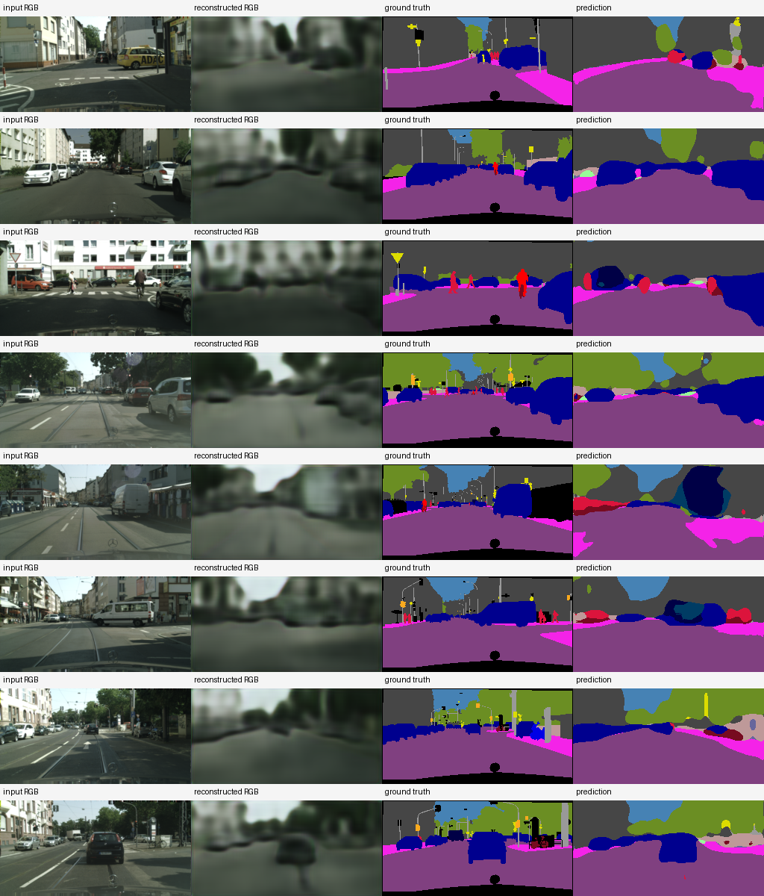

# 이전 컴퓨터와 현재 컴퓨터의 실험 결과 비교 보고서

> 작성일: 2026-07-12  
> 비교 대상: 작업 이전 `paperlike_timed_latent20` 결과와 현재 `enhanced_scalable_full_256x128_verified` 결과  
> 한 줄 결론: **현재 결과의 모델 품질과 기능은 더 좋다. 다만 컴퓨터뿐 아니라 데이터 수, 해상도, 모델 구조와 학습 방법도 함께 바뀌었으므로 향상분 전체를 새 컴퓨터 덕분이라고 말할 수는 없다.**

## 1. 가장 쉬운 결론

질문을 세 부분으로 나누면 답이 명확하다.

| 질문 | 답 |
|---|---|
| 현재 AI 모델의 정확도가 더 높은가? | **예.** mIoU가 0.213473에서 0.305416으로 상승했다. |
| 현재 모델의 기능이 더 많은가? | **예.** 실제 8비트 전송, RGB 복원, 5단계 압축을 추가했다. |
| 새 컴퓨터 하나만으로 정확도가 오른 것인가? | **확인할 수 없다.** 데이터·해상도·모델·loss도 함께 바뀌었다. |
| 논문 그래프와 더 똑같아졌는가? | **거의 비슷하다.** 불일치는 40개에서 39개로 1개 줄었지만 match도 18개에서 17개로 1개 줄었다. |
| 후속 적응형 결과가 숫자상 더 좋은가? | **이전 proxy가 더 낙관적이었다.** 현재 결과는 개선폭이 작지만 실제 neural 오류를 포함해 더 현실적이다. |

따라서 실용적인 요약은 다음과 같다.

> **현재 컴퓨터에서 만든 모델이 더 강하고 실험도 더 믿을 만하다. 그러나 이것은 새 컴퓨터, 더 많은 데이터, 큰 이미지, 강화된 모델과 학습법을 모두 합친 결과다.**

## 2. 비교에 사용한 증거

추측이 아니라 저장된 JSON 결과를 기준으로 비교했다.

| 구분 | 증거 파일 | SHA-256 |
|---|---|---|
| 이전 모델 요약 | `studies/neural_encoder_decoder/results/paperlike_timed_latent20/result_summary.json` | `c6a7b1367b18dd16aae15f0907dfdfd569a6d5c6d81cb5b334814dfe35ce25f8` |
| 이전 AirTalking profile | `studies/neural_encoder_decoder/results/paperlike_timed_latent20/airtalking_semantic_summary.json` | `e55ea13d69dc375f58fb2716a2680fa3ccf67945b4a9326730bf952b34827a7d` |
| 현재 모델 요약 | `studies/neural_encoder_decoder/results/enhanced_scalable_full_256x128_verified/result_summary.json` | `83b6f3f518436f7952ba1f03e5ec85931e834477c262e168de1f903fbe53a295` |
| 현재 AirTalking profile | `studies/neural_encoder_decoder/results/enhanced_scalable_full_256x128_verified/airtalking_semantic_summary.json` | `4e7ef21828e97075f4c8b5fdd51dd85a8f5427c6950c09915d5d13509fc67e08` |

현재 컴퓨터 사양은 2026-07-12에 Windows WMI와 `nvidia-smi`로 다시 조회했다. 현재 GPU 이름은 학습 결과 JSON에도 기록돼 있다.

이전 결과 JSON에는 `device=cpu`만 있고 CPU 모델명, RAM, GPU, OS, Python/PyTorch 버전이 없다. 따라서 이전 컴퓨터 사양은 기억에 의존해 채우지 않고 **기록 없음**으로 둔다.

## 3. 컴퓨터 환경 비교

| 항목 | 이전 컴퓨터 | 현재 컴퓨터 |
|---|---|---|
| 실행 장치 | CPU | CUDA GPU |
| CPU 모델 | 기록 없음 | AMD Ryzen 5 7500F |
| CPU 코어/스레드 | 기록 없음 | 6코어 / 12스레드 |
| RAM | 기록 없음 | 약 31.74 GiB |
| GPU | 기록 없음 | NVIDIA GeForce RTX 4060 Ti |
| GPU 메모리 | 기록 없음 | 8,188 MiB, 약 8 GiB |
| NVIDIA driver | 기록 없음 | 560.94 |
| OS | 기록 없음 | Windows 10 Home 64-bit, 10.0.19045 |
| Python | 기록 없음 | 3.12.4 |
| PyTorch | 기록 없음 | 2.12.1+cu126 |
| CUDA / cuDNN | 기록 없음 | CUDA 12.6 / cuDNN 91002 |

### 쉬운 해석

- GPU는 수천 개의 작은 계산을 동시에 처리하기 때문에 이미지 딥러닝에 유리하다.
- 현재 GPU 덕분에 더 큰 이미지와 전체 학습 데이터를 현실적인 시간 안에 처리할 수 있었다.
- 그러나 GPU가 바뀐다고 같은 모델의 정답률이 자동으로 높아지는 것은 아니다.
- 정확도는 주로 데이터, 해상도, 모델 구조, loss와 학습 과정에 의해 달라진다.

## 4. 실제로는 컴퓨터만 바뀐 실험이 아니다

두 결과의 설정은 다음처럼 크게 다르다.

| 항목 | 이전 결과 | 현재 결과 | 변화 |
|---|---:|---:|---:|
| 학습 이미지 | 512장 | 2,975장 | 5.81배 |
| 검증 이미지 | 256장 | 500장 | 1.95배 |
| 입력 크기 | 128×64 | 256×128 | 픽셀 4배 |
| 검증 클래스 | 19개 | 19개 | 동일 |
| latent downsample | 1/8 | 1/16 | 구조 변경 |
| 활성 latent 채널 | 20개 고정 | 20/40/60/80/120 | 5단계 지원 |
| paper-like 채널 | 20 | 80 | 둘 다 이론상 ρ≈0.10417 |
| decoder 출력 | segmentation만 | RGB 복원+segmentation | 기능 확대 |
| 양자화 | 8비트라고 계산상 가정 | 모든 forward에서 실제 8비트 STE | 실제 전송 경로 추가 |
| 최종 checkpoint | 저장된 best epoch 27 | best와 last를 5개 rate에서 비교, best epoch 19 선택 | 선택 절차 강화 |

따라서 이 비교는 다음 질문에는 답한다.

> “작업 전 시스템보다 현재 강화 시스템이 좋아졌는가?” → **예.**

하지만 다음 질문에는 답하지 못한다.

> “컴퓨터만 바꿨을 때 얼마나 좋아졌는가?” → **별도의 동일 조건 재실험이 필요하다.**

## 5. 모델 정확도 비교

### 5.1 핵심 지표

| 지표 | 이전 결과 | 현재 결과 | 차이 | 해석 |
|---|---:|---:|---:|---|
| mIoU | 0.213473 | 0.305416 | +0.091942 | 상대 +43.07% |
| Pixel accuracy | 0.740795 | 0.828616 | +0.087821 | +8.78%p |
| 평가 표본 | 256 | 500 | +244 | 현재가 전체 val 사용 |
| RGB PSNR | 미측정 | 18.435 dB | 새 지표 | 이전은 RGB를 복원하지 않음 |
| RGB SSIM | 미측정 | 0.567506 | 새 지표 | 로컬 7×7 uniform-window proxy |

### 5.2 용어를 쉽게 설명하면

- **Pixel accuracy**는 평가한 모든 도로 픽셀 중 맞힌 픽셀의 비율이다.
- **IoU**는 정답 영역과 예측 영역이 얼마나 겹치는지를 보는 값이다.
- **mIoU**는 19개 클래스의 IoU를 평균한 값이다. 넓은 도로만 잘 맞히고 작은 사람을 놓치는 문제를 pixel accuracy보다 더 잘 드러낸다.
- **PSNR과 SSIM**은 복원된 RGB 이미지가 원본과 얼마나 비슷한지 보는 지표다.

### 5.3 무엇이 좋아졌는가

현재 모델의 mIoU는 이전보다 상대적으로 약 43.1% 높다. Pixel accuracy도 8.78 percentage point 상승했다. 또한 이전 모델이 만들지 못했던 RGB 복원 결과도 생성한다.

다만 이 수치는 동일 조건 A/B test가 아니다. 현재 쪽이 더 많은 데이터와 더 큰 해상도를 사용했으므로, 43.1% 전체를 GPU나 새 decoder 하나의 효과로 분해할 수 없다.

아래 그림은 현재 모델의 입력 RGB, 복원 RGB, 정답 segmentation, 예측 segmentation을 보여 준다. 이전 실행에는 동일 형식의 정성 panel이 남아 있지 않아 완전한 좌우 시각 비교는 할 수 없다.

## 6. 처리속도 비교

### 6.1 저장된 median 시간

| 구간 | 이전 CPU 결과 | 현재 GPU 결과 | 표면상 차이 |
|---|---:|---:|---:|
| encoder | 1.749 ms | 1.872 ms | 현재 +7.0% |
| decoder | 2.529 ms | 3.012 ms | 현재 +19.1% |
| 전체 forward | 4.485 ms | 4.998 ms | 현재 +11.4% |

이 표만 보면 현재가 약간 느려 보일 수 있다. 그러나 처리하는 일이 같지 않다.

- 이전: 128×64, 8,192픽셀, segmentation만 출력
- 현재: 256×128, 32,768픽셀, 픽셀 4배, RGB와 segmentation을 함께 출력
- 현재: 실제 8비트 fake quantization도 forward에 포함

즉 현재 모델은 약 11.4% 긴 시간으로 4배 픽셀과 더 많은 기능을 처리한다.

### 6.2 참고용 픽셀 처리량

전체 forward 시간을 단순히 입력 픽셀 수로 나누면 다음과 같다.

| 항목 | 이전 | 현재 |
|---|---:|---:|
| 입력 픽셀/초 | 약 1.83 million | 약 6.56 million |
| 픽셀 기준 배수 | 1.00× | 약 3.59× |

이 값은 이해를 돕는 참고치일 뿐이다. 모델 출력과 계산량이 다르므로 공정한 하드웨어 benchmark로 사용하면 안 된다.

### 6.3 저장된 feature 처리율

| 지표 | 이전 | 현재 | 배수 |
|---|---:|---:|---:|
| encoder input throughput | 112.40 Mbps | 420.06 Mbps | 3.74× |
| decoder restoration throughput | 24.30 Mbps | 81.60 Mbps | 3.36× |

현재 처리율은 크게 높지만 해상도, 처리 byte 정의, 모델과 컴퓨터가 함께 바뀌었다. 따라서 “RTX 4060 Ti가 이전 컴퓨터보다 정확히 3.74배 빠르다”라고 해석해서는 안 된다.

## 7. 학습시간 비교가 불가능한 이유

이전 `result_summary.json`에는 `elapsed_seconds=17.89`가 있다. 그러나 같은 파일에 `epochs=0`으로 기록돼 있으며, 저장된 checkpoint를 불러와 평가하고 결과를 내보낸 시간이다. 전체 27 epoch 학습시간이 아니다.

현재 강화 run은 데이터 재검증, 20 epoch 학습, 최종 5-rate 평가와 산출물 생성을 포함해 약 1,628.90초, 즉 약 27분 9초가 걸렸다.

따라서 다음 비교는 잘못이다.

> “이전 학습 17.89초 vs 현재 학습 27분”

이전 전체 학습시간이 저장되지 않았기 때문에 학습시간의 컴퓨터 간 배수는 계산할 수 없다.

## 8. 압축 기능 비교

| 기능 | 이전 | 현재 |
|---|---|---|
| paper-like raw payload ratio | 0.1041667 | 0.1041667 |
| 실제 uint8 byte 생성 | 아니오 | 예 |
| byte round trip 검증 | 아니오 | 예 |
| zlib payload 측정 | 아니오 | 예, 80채널 ρ=0.099276 |
| 다중 rate | 아니오 | 20/40/60/80/120채널 |
| receiver가 encoder skip을 사용 | 구조상 segmentation decoder | 아니오, 전송 latent만 사용 |
| RGB visual decoder | 없음 | 있음 |

두 모델의 paper-like ratio가 같아 보이는 이유는 압축 목표를 논문 값 약 0.104에 맞췄기 때문이다. 하지만 이전 값은 8비트라고 가정해 계산한 값이고, 현재 값은 실제 직렬화된 uint8 latent byte에서 측정한 값이다.

## 9. 논문 실험 재현 결과 비교

논문 그림 판독값과 비교한 73개 판정은 다음과 같다.

| 판정 | 이전 calibrated 결과 | 현재 강화 결과 | 변화 |
|---|---:|---:|---:|
| match | 18 | 17 | -1 |
| partial | 15 | 17 | +2 |
| mismatch | 40 | 39 | -1 |

이 결과는 **거의 비슷하다**고 판단하는 것이 맞다. mismatch가 하나 줄었지만 match도 하나 줄었다. 현재 neural codec이 좋아졌다고 해서 simulator의 숨은 request 확률, workload, 전력, 간섭과 정책 parameter까지 자동으로 논문과 같아지는 것은 아니다.

즉 다음 두 문장은 동시에 참이다.

1. 현재 neural encoder/decoder 모델은 이전보다 좋아졌다.
2. AirTalking 논문 그래프의 정량 재현도는 뚜렷하게 좋아졌다고 보기 어렵다.

## 10. 적응형 후속 연구 비교

| 항목 | 이전 proxy 후속 실험 | 현재 실제 neural 후속 실험 |
|---|---:|---:|
| fixed 대비 완료 수 증가+시간 감소 조합 | 25/25 | 23/25 |
| 완료 수 변화율의 조합 평균 | +25.16% | +18.78% |
| 평균 시간 변화율의 조합 평균 | -33.13% | -26.61% |
| Stochastic 400m/500m | 개선 | 두 조합에서 실패 |
| 품질 출처 | 정답 label 축소 proxy | 실제 neural decoded 결과의 mIoU |
| 실제 encoder 오류 포함 | 아니오 | 예 |

숫자만 보면 이전 결과가 더 좋아 보인다. 그러나 이전 방식은 정답 label에서 시작했기 때문에 encoder가 틀리는 상황이 없었다. 그래서 지나치게 낙관적인 결과가 나올 수 있다.

현재 결과는 23/25로 개선 조합 수가 줄었지만 다음 이유로 더 믿을 만하다.

- 실제 RGB encoder와 decoder의 오류를 포함한다.
- 실제 uint8 payload를 사용한다.
- 750개 repeat 원시 행을 보존한다.
- Student-t 95% 신뢰구간을 저장한다.
- 데이터, 소스, validator와 산출물 SHA-256을 기록한다.
- 실패한 두 조합을 숨기지 않고 `all_comparisons_pass=false`로 남긴다.

따라서 **이전은 더 좋아 보이는 결과**, **현재는 더 현실적이고 검증 가능한 결과**라고 이해하면 된다.

## 11. 현재 결과가 좋아진 원인

### 11.1 가장 큰 원인: 데이터 증가

학습 이미지가 512장에서 2,975장으로 약 5.81배 늘었다. 모델이 더 다양한 도시, 도로, 차량, 사람과 조명 조건을 학습할 수 있다.

### 11.2 해상도 증가

픽셀이 4배 늘어 작은 사람, 자전거, 표지판과 경계를 구분할 정보가 많아졌다.

### 11.3 모델 구조 강화

현재 decoder는 residual block과 단계적 upsampling을 사용하고 RGB 복원과 19-class segmentation을 함께 학습한다.

### 11.4 loss 강화

- class-balanced cross entropy: 자주 등장하지 않는 클래스를 무시하지 않도록 도움
- Dice loss: 예측 영역과 정답 영역의 겹침을 직접 개선
- RGB L1 loss: 복원 영상의 픽셀 오차를 줄임
- SSIM loss: 밝기뿐 아니라 국소 구조도 비슷하게 만듦

### 11.5 augmentation과 최적화

random scale/crop, horizontal flip, color jitter를 사용했고 AdamW, cosine scheduler, AMP, gradient accumulation과 clipping을 적용했다.

### 11.6 더 좋은 checkpoint 선택

마지막 epoch를 무조건 선택하지 않았다. 학습 중 가장 좋은 80채널 checkpoint와 마지막 checkpoint를 5개 rate에서 모두 평가해 평균 mIoU가 높은 쪽을 최종 선택했다.

### 11.7 현재 하드웨어의 역할

RTX 4060 Ti는 위의 큰 데이터, 큰 해상도, 다중 rate 학습을 빠르게 수행할 수 있게 해 준 **수단**이다. GPU 자체가 정답을 더 잘 알게 한 것이 아니라 더 강한 학습 설정을 실행할 수 있게 해 줬다.

## 12. 무엇을 새 컴퓨터 효과라고 말할 수 있는가

### 말할 수 있는 것

- 현재 컴퓨터는 CUDA AMP로 전체 Cityscapes와 256×128 모델을 약 27분 안에 학습·평가했다.
- 현재 모델은 4배 픽셀과 RGB+segmentation 출력을 약 5 ms median forward로 처리했다.
- GPU 덕분에 더 큰 실험을 반복하고 다섯 rate를 평가할 수 있었다.

### 말할 수 없는 것

- 정확도 +43.07% 전체가 RTX 4060 Ti 때문이라고 주장
- 이전 컴퓨터보다 정확히 몇 배 빠르다고 주장
- 이전 17.89초를 전체 학습시간으로 해석
- 서로 다른 해상도와 모델의 latency를 동일 benchmark라고 주장

## 13. 정말로 컴퓨터 성능만 비교하려면

다음 조건을 두 컴퓨터에서 완전히 같게 해야 한다.

1. 같은 git commit과 Python/PyTorch 버전 사용
2. 같은 Cityscapes fingerprint 사용
3. 같은 500개 validation 이미지와 같은 resize 사용
4. 같은 checkpoint 파일 사용
5. batch size 1, 같은 warm-up 횟수 사용
6. CPU 또는 GPU 장치를 동일 종류로 비교
7. GPU timing 전후에 synchronize 실행
8. encoder, decoder, full forward를 각각 최소 100회 측정
9. median, p95, 평균과 표준편차 저장
10. GPU 전력, 온도와 peak memory도 기록

이렇게 하면 모델 품질은 고정한 채 컴퓨터의 순수 추론속도만 비교할 수 있다. 학습속도를 비교하려면 같은 초기 seed와 epoch 수로 처음부터 학습해야 한다.

## 14. 최종 판단

| 평가 항목 | 최종 판단 |
|---|---|
| 모델 정확도 | 현재가 더 좋음 |
| 모델 기능 | 현재가 훨씬 많음 |
| 실제 압축 구현 | 현재가 더 정확함 |
| 처리량 | 현재 기록이 높지만 동일 조건 benchmark는 아님 |
| 논문 수치 일치도 | 이전과 거의 비슷함 |
| 적응형 개선폭 | 이전 proxy가 더 크게 보였음 |
| 후속 결과 신뢰성 | 현재가 훨씬 높음 |
| 새 컴퓨터만의 기여도 | 현재 증거로 분리 불가 |

최종 결론은 다음과 같다.

> **현재 결과는 이전 결과보다 실제 모델로서 더 좋다. 새 컴퓨터가 더 큰 학습을 가능하게 했지만, 정확도 상승은 컴퓨터 하나가 아니라 데이터·해상도·모델·loss·학습 절차 전체를 강화한 결과다. 논문 재현 수치는 거의 비슷하고, 후속 실험은 개선폭이 줄었지만 훨씬 현실적이고 신뢰할 수 있게 됐다.**

## 15. 용어 요약

| 용어 | 쉬운 뜻 |
|---|---|
| CPU | 일반 작업을 순서대로 빠르게 처리하는 프로세서 |
| GPU | 많은 계산을 동시에 처리해 이미지 딥러닝에 유리한 프로세서 |
| CUDA | NVIDIA GPU에서 딥러닝 계산을 실행하는 환경 |
| epoch | 전체 학습 데이터를 한 번 모두 본 횟수 |
| checkpoint | 특정 학습 시점의 모델 가중치 저장 파일 |
| latency | 한 번 처리하는 데 걸린 시간 |
| throughput | 일정 시간 동안 처리한 데이터 양 |
| mIoU | 클래스별 예측 영역 겹침을 평균한 정확도 지표 |
| pixel accuracy | 평가 픽셀 중 정답을 맞힌 비율 |
| quantization | 실수 값을 작은 정수 표현으로 바꾸어 전송량을 줄이는 과정 |
| proxy | 실제 대상을 대신해 간접적으로 만든 측정치 |
| A/B test | 다른 조건은 고정하고 한 요소만 바꿔 비교하는 실험 |

